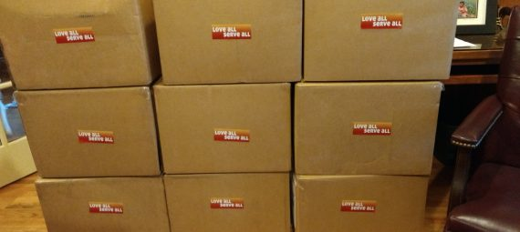
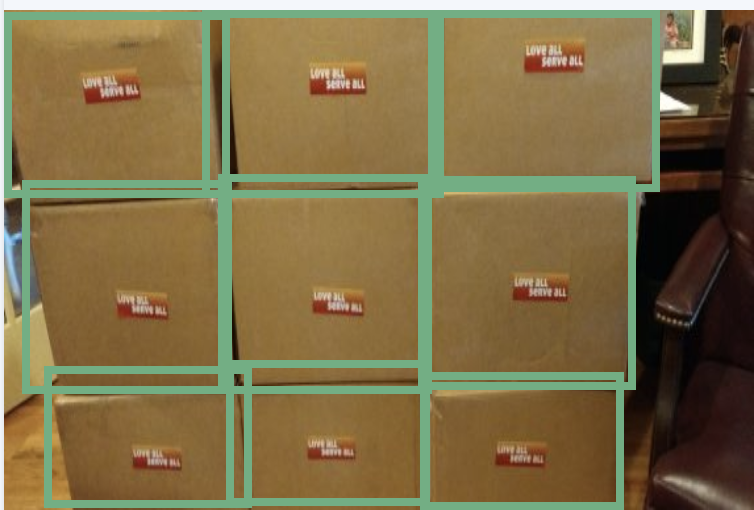

## Disaster Relief Inventory Counter

Where ever disaster strikes, whether in a third world country or even right here in the United States, resources that come in from relief groups are often scarce, which puts an even stronger emphasis on proper logistics and inventorty tracking. In events like these, you often will find yourself in a low-bandwith environment, which brings with it a number of organizational issues.

Using a well-trained machine vision model on our Raspberry Pi 3, our aim is to provide a low-power, portable tool that allows for inventory tracking in disaster struck areas. Whether it's for fraud prevention, or to have a live feed of when there are changes in your stock, the tool utilizes visual recognition to make sure these scarce resources are being distributed properly and not getting lost among the many other things going on.

# Example Input:

# Example Output:

